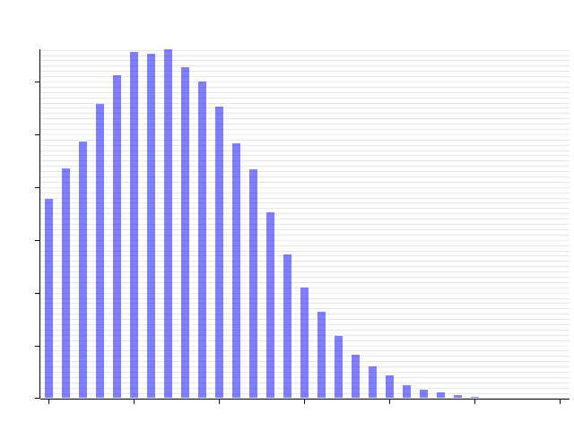

# Gaussian Signal Generation 

> This practicle implementation of random signal generation method 
from chapter 2 of "The Scientist and Engineer's Guide to Digital 
Signal Processing" by Steven W. Smith, Ph.D. 

This is purely done for my understanding and is not intended to be 
used in production.

## Citations

[Book](http://www.dspguide.com/)
